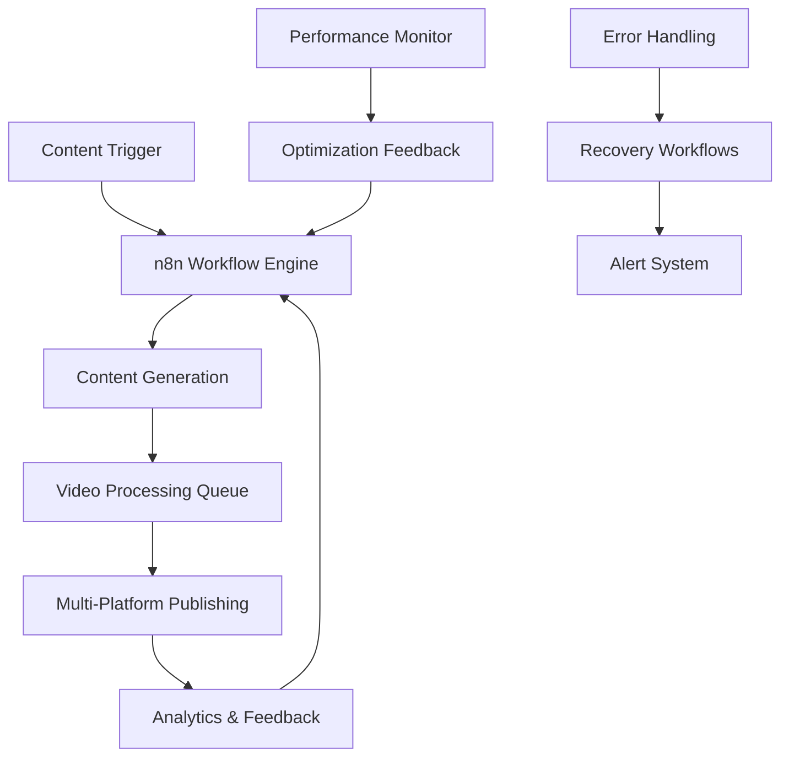
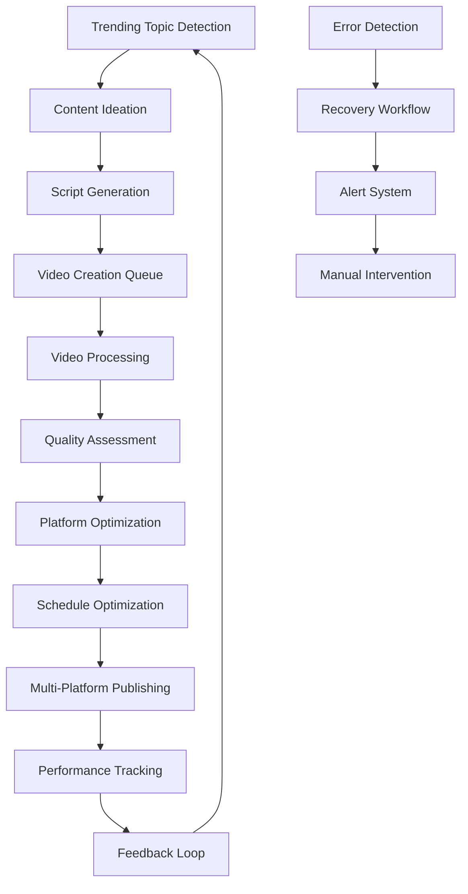

# n8n Workflow Integration Plan - Milestone 5

## Executive Summary

This comprehensive plan outlines the complete n8n workflow integration for the Short Video Maker platform, enabling end-to-end automation from content ideation to multi-platform publishing. The integration leverages the existing webhook infrastructure, queue management system, and platform APIs to create seamless automated workflows.

## Architecture Overview



## 1. Core n8n Workflow Templates

### 1.1 Master Video Creation Workflow

**Workflow ID:** `video-creation-master`
**Description:** End-to-end video creation from topic to published content

```json
{
  "name": "Master Video Creation Workflow",
  "nodes": [
    {
      "parameters": {
        "triggerOn": "everyMinute",
        "interval": 15
      },
      "name": "Content Trigger",
      "type": "n8n-nodes-base.cron",
      "typeVersion": 1,
      "position": [200, 200]
    },
    {
      "parameters": {
        "httpMethod": "GET",
        "url": "={{ $json.trendingTopicsApi }}/trending",
        "options": {
          "timeout": 30000
        }
      },
      "name": "Fetch Trending Topics",
      "type": "n8n-nodes-base.httpRequest",
      "typeVersion": 1,
      "position": [400, 200]
    },
    {
      "parameters": {
        "functionCode": "// AI-powered topic selection\nconst topics = items[0].json.data;\nconst selectedTopics = topics\n  .filter(t => t.engagement_score > 8)\n  .slice(0, 3)\n  .map(topic => ({\n    topic: topic.title,\n    category: topic.category,\n    keywords: topic.keywords,\n    templateType: determineTemplate(topic.category)\n  }));\n\nfunction determineTemplate(category) {\n  const mapping = {\n    'technology': 'educational_facts',\n    'entertainment': 'entertainment_story',\n    'business': 'marketing_product_demo',\n    'news': 'news_trending_topic'\n  };\n  return mapping[category] || 'educational_facts';\n}\n\nreturn selectedTopics.map(topic => ({ json: topic }));"
      },
      "name": "Process Topics",
      "type": "n8n-nodes-base.function",
      "typeVersion": 1,
      "position": [600, 200]
    },
    {
      "parameters": {
        "httpMethod": "POST",
        "url": "http://localhost:3000/api/v2/scripts/generate",
        "bodyParametersUi": {
          "parameter": [
            {
              "name": "prompt",
              "value": "={{ $json.topic }}"
            },
            {
              "name": "contentType",
              "value": "={{ $json.category }}"
            },
            {
              "name": "platform",
              "value": "youtube_shorts"
            }
          ]
        },
        "options": {
          "timeout": 60000
        }
      },
      "name": "Generate Script",
      "type": "n8n-nodes-base.httpRequest",
      "typeVersion": 1,
      "position": [800, 200]
    },
    {
      "parameters": {
        "httpMethod": "POST",
        "url": "http://localhost:3000/api/v2/videos",
        "bodyParametersUi": {
          "parameter": [
            {
              "name": "scenes",
              "value": "={{ $json.scenes }}"
            },
            {
              "name": "config",
              "value": "={{ $json.renderConfig }}"
            }
          ]
        }
      },
      "name": "Create Video",
      "type": "n8n-nodes-base.httpRequest",
      "typeVersion": 1,
      "position": [1000, 200]
    },
    {
      "parameters": {
        "httpMethod": "GET",
        "url": "http://localhost:3000/api/v2/videos/{{ $json.videoId }}/status",
        "options": {
          "timeout": 300000
        }
      },
      "name": "Monitor Video Status",
      "type": "n8n-nodes-base.httpRequest",
      "typeVersion": 1,
      "position": [1200, 200]
    },
    {
      "parameters": {
        "conditions": {
          "string": [
            {
              "value1": "={{ $json.status }}",
              "operation": "equal",
              "value2": "completed"
            }
          ]
        }
      },
      "name": "Check Completion",
      "type": "n8n-nodes-base.if",
      "typeVersion": 1,
      "position": [1400, 200]
    }
  ],
  "connections": {
    "Content Trigger": {
      "main": [
        [
          {
            "node": "Fetch Trending Topics",
            "type": "main",
            "index": 0
          }
        ]
      ]
    },
    "Fetch Trending Topics": {
      "main": [
        [
          {
            "node": "Process Topics",
            "type": "main",
            "index": 0
          }
        ]
      ]
    },
    "Process Topics": {
      "main": [
        [
          {
            "node": "Generate Script",
            "type": "main",
            "index": 0
          }
        ]
      ]
    },
    "Generate Script": {
      "main": [
        [
          {
            "node": "Create Video",
            "type": "main",
            "index": 0
          }
        ]
      ]
    },
    "Create Video": {
      "main": [
        [
          {
            "node": "Monitor Video Status",
            "type": "main",
            "index": 0
          }
        ]
      ]
    },
    "Monitor Video Status": {
      "main": [
        [
          {
            "node": "Check Completion",
            "type": "main",
            "index": 0
          }
        ]
      ]
    }
  }
}
```

### 1.2 Multi-Platform Publishing Workflow

**Workflow ID:** `multi-platform-publisher`

```json
{
  "name": "Multi-Platform Publisher",
  "nodes": [
    {
      "parameters": {
        "httpMethod": "POST",
        "path": "/webhook/video-completed"
      },
      "name": "Video Completion Webhook",
      "type": "n8n-nodes-base.webhook",
      "typeVersion": 1,
      "position": [200, 200]
    },
    {
      "parameters": {
        "functionCode": "// Platform-specific optimization\nconst videoData = items[0].json;\nconst platforms = [\n  {\n    name: 'youtube_shorts',\n    maxDuration: 60,\n    aspectRatio: '9:16',\n    titleMaxLength: 100,\n    descriptionMaxLength: 5000\n  },\n  {\n    name: 'tiktok',\n    maxDuration: 60,\n    aspectRatio: '9:16',\n    titleMaxLength: 150,\n    captionMaxLength: 2200\n  },\n  {\n    name: 'instagram_reels',\n    maxDuration: 90,\n    aspectRatio: '9:16',\n    titleMaxLength: 125,\n    captionMaxLength: 2200\n  },\n  {\n    name: 'twitter',\n    maxDuration: 140,\n    aspectRatio: '16:9',\n    titleMaxLength: 280,\n    captionMaxLength: 280\n  }\n];\n\nconst optimizedContent = platforms.map(platform => ({\n  platform: platform.name,\n  videoPath: videoData.outputPath,\n  title: truncateText(videoData.title, platform.titleMaxLength),\n  description: truncateText(videoData.description, platform.descriptionMaxLength || platform.captionMaxLength),\n  tags: videoData.tags,\n  scheduledTime: calculateOptimalTime(platform.name)\n}));\n\nfunction truncateText(text, maxLength) {\n  return text.length > maxLength ? text.substring(0, maxLength - 3) + '...' : text;\n}\n\nfunction calculateOptimalTime(platform) {\n  const optimalTimes = {\n    'youtube_shorts': '18:00',\n    'tiktok': '19:00',\n    'instagram_reels': '17:30',\n    'twitter': '12:00'\n  };\n  return optimalTimes[platform] || '18:00';\n}\n\nreturn optimizedContent.map(content => ({ json: content }));"
      },
      "name": "Optimize for Platforms",
      "type": "n8n-nodes-base.function",
      "typeVersion": 1,
      "position": [400, 200]
    },
    {
      "parameters": {
        "conditions": {
          "string": [
            {
              "value1": "={{ $json.platform }}",
              "operation": "equal",
              "value2": "youtube_shorts"
            }
          ]
        }
      },
      "name": "Route to YouTube",
      "type": "n8n-nodes-base.if",
      "typeVersion": 1,
      "position": [600, 100]
    },
    {
      "parameters": {
        "conditions": {
          "string": [
            {
              "value1": "={{ $json.platform }}",
              "operation": "equal",
              "value2": "tiktok"
            }
          ]
        }
      },
      "name": "Route to TikTok",
      "type": "n8n-nodes-base.if",
      "typeVersion": 1,
      "position": [600, 200]
    },
    {
      "parameters": {
        "conditions": {
          "string": [
            {
              "value1": "={{ $json.platform }}",
              "operation": "equal",
              "value2": "instagram_reels"
            }
          ]
        }
      },
      "name": "Route to Instagram",
      "type": "n8n-nodes-base.if",
      "typeVersion": 1,
      "position": [600, 300]
    },
    {
      "parameters": {
        "conditions": {
          "string": [
            {
              "value1": "={{ $json.platform }}",
              "operation": "equal",
              "value2": "twitter"
            }
          ]
        }
      },
      "name": "Route to Twitter",
      "type": "n8n-nodes-base.if",
      "typeVersion": 1,
      "position": [600, 400]
    }
  ],
  "connections": {
    "Video Completion Webhook": {
      "main": [
        [
          {
            "node": "Optimize for Platforms",
            "type": "main",
            "index": 0
          }
        ]
      ]
    },
    "Optimize for Platforms": {
      "main": [
        [
          {
            "node": "Route to YouTube",
            "type": "main",
            "index": 0
          },
          {
            "node": "Route to TikTok",
            "type": "main",
            "index": 0
          },
          {
            "node": "Route to Instagram",
            "type": "main",
            "index": 0
          },
          {
            "node": "Route to Twitter",
            "type": "main",
            "index": 0
          }
        ]
      ]
    }
  }
}
```

## 2. Platform Integration APIs

### 2.1 YouTube Shorts API Integration

```javascript
// YouTube Shorts Publishing Node
class YouTubeShortsPublisher {
  async execute() {
    const { google } = require('googleapis');
    const youtube = google.youtube('v3');
    
    const videoMetadata = {
      snippet: {
        title: this.getNodeParameter('title'),
        description: this.getNodeParameter('description'),
        tags: this.getNodeParameter('tags'),
        categoryId: '22', // People & Blogs
        defaultLanguage: 'en',
        defaultAudioLanguage: 'en'
      },
      status: {
        privacyStatus: 'public',
        selfDeclaredMadeForKids: false
      }
    };

    const media = {
      body: fs.createReadStream(this.getNodeParameter('videoPath')),
      mimeType: 'video/mp4'
    };

    try {
      const response = await youtube.videos.insert({
        part: 'snippet,status',
        resource: videoMetadata,
        media: media
      });

      return {
        videoId: response.data.id,
        url: `https://youtube.com/shorts/${response.data.id}`,
        status: 'published'
      };
    } catch (error) {
      throw new Error(`YouTube upload failed: ${error.message}`);
    }
  }
}
```

### 2.2 TikTok API Integration

```javascript
// TikTok Publishing Node
class TikTokPublisher {
  async execute() {
    const axios = require('axios');
    const FormData = require('form-data');
    
    const form = new FormData();
    form.append('video', fs.createReadStream(this.getNodeParameter('videoPath')));
    form.append('post_info', JSON.stringify({
      title: this.getNodeParameter('title'),
      privacy_level: 'PUBLIC_TO_EVERYONE',
      disable_duet: false,
      disable_comment: false,
      disable_stitch: false,
      video_cover_timestamp_ms: 1000
    }));

    try {
      const response = await axios.post(
        'https://open-api.tiktok.com/share/video/upload/',
        form,
        {
          headers: {
            'Authorization': `Bearer ${this.getCredentials('tiktokApi').access_token}`,
            'Content-Type': 'application/json',
            ...form.getHeaders()
          }
        }
      );

      return {
        shareId: response.data.data.share_id,
        publishId: response.data.data.publish_id,
        status: 'uploaded'
      };
    } catch (error) {
      throw new Error(`TikTok upload failed: ${error.message}`);
    }
  }
}
```

### 2.3 Instagram Reels API Integration

```javascript
// Instagram Reels Publishing Node
class InstagramReelsPublisher {
  async execute() {
    const axios = require('axios');
    
    // Step 1: Upload video
    const uploadResponse = await axios.post(
      `https://graph.facebook.com/v18.0/${this.getCredentials('instagram').pageId}/media`,
      {
        media_type: 'REELS',
        video_url: this.getNodeParameter('videoUrl'),
        caption: this.getNodeParameter('caption'),
        cover_url: this.getNodeParameter('coverUrl'),
        share_to_feed: true
      },
      {
        headers: {
          'Authorization': `Bearer ${this.getCredentials('instagram').accessToken}`
        }
      }
    );

    // Step 2: Publish media
    const publishResponse = await axios.post(
      `https://graph.facebook.com/v18.0/${this.getCredentials('instagram').pageId}/media_publish`,
      {
        creation_id: uploadResponse.data.id
      },
      {
        headers: {
          'Authorization': `Bearer ${this.getCredentials('instagram').accessToken}`
        }
      }
    );

    return {
      mediaId: publishResponse.data.id,
      status: 'published'
    };
  }
}
```

### 2.4 Twitter Video API Integration

```javascript
// Twitter Video Publishing Node
class TwitterVideoPublisher {
  async execute() {
    const { TwitterApi } = require('twitter-api-v2');
    
    const client = new TwitterApi({
      appKey: this.getCredentials('twitter').apiKey,
      appSecret: this.getCredentials('twitter').apiSecret,
      accessToken: this.getCredentials('twitter').accessToken,
      accessSecret: this.getCredentials('twitter').accessTokenSecret
    });

    try {
      // Upload video
      const mediaUpload = await client.v1.uploadMedia(
        this.getNodeParameter('videoPath'),
        { mimeType: 'video/mp4' }
      );

      // Create tweet with video
      const tweet = await client.v2.tweet({
        text: this.getNodeParameter('text'),
        media: {
          media_ids: [mediaUpload]
        }
      });

      return {
        tweetId: tweet.data.id,
        url: `https://twitter.com/i/status/${tweet.data.id}`,
        status: 'published'
      };
    } catch (error) {
      throw new Error(`Twitter upload failed: ${error.message}`);
    }
  }
}
```

## 3. Automated Content Scheduling Workflows

### 3.1 Smart Scheduling Algorithm

```json
{
  "name": "Smart Content Scheduler",
  "nodes": [
    {
      "parameters": {
        "functionCode": "// Optimal posting time calculator\nconst timezone = $json.userTimezone || 'UTC';\nconst platform = $json.platform;\nconst contentType = $json.contentType;\n\nconst optimalTimes = {\n  'youtube_shorts': {\n    'educational': ['14:00', '18:00', '20:00'],\n    'entertainment': ['17:00', '19:00', '21:00'],\n    'news_trends': ['08:00', '12:00', '18:00'],\n    'marketing': ['10:00', '14:00', '16:00']\n  },\n  'tiktok': {\n    'educational': ['18:00', '19:00', '21:00'],\n    'entertainment': ['19:00', '20:00', '22:00'],\n    'news_trends': ['07:00', '12:00', '19:00'],\n    'marketing': ['11:00', '15:00', '18:00']\n  },\n  'instagram_reels': {\n    'educational': ['11:00', '17:00', '19:00'],\n    'entertainment': ['18:00', '19:30', '21:00'],\n    'news_trends': ['08:00', '13:00', '17:00'],\n    'marketing': ['12:00', '17:00', '19:00']\n  },\n  'twitter': {\n    'educational': ['09:00', '13:00', '17:00'],\n    'entertainment': ['12:00', '18:00', '20:00'],\n    'news_trends': ['06:00', '12:00', '17:00'],\n    'marketing': ['10:00', '14:00', '16:00']\n  }\n};\n\n// Get best times for platform and content type\nconst bestTimes = optimalTimes[platform]?.[contentType] || optimalTimes[platform]?.['educational'] || ['18:00'];\n\n// Calculate next posting time\nconst now = new Date();\nconst today = now.toISOString().split('T')[0];\n\nconst scheduledTimes = bestTimes.map(time => {\n  const [hours, minutes] = time.split(':');\n  const scheduleDate = new Date(today + 'T' + time + ':00');\n  \n  // If time has passed today, schedule for tomorrow\n  if (scheduleDate <= now) {\n    scheduleDate.setDate(scheduleDate.getDate() + 1);\n  }\n  \n  return scheduleDate.toISOString();\n});\n\nreturn [{ json: { scheduledTimes, selectedTime: scheduledTimes[0] } }];"
      },
      "name": "Calculate Optimal Time",
      "type": "n8n-nodes-base.function",
      "typeVersion": 1
    },
    {
      "parameters": {
        "triggerOn": "cronExpression",
        "cronExpression": "0 */15 * * * *"
      },
      "name": "Schedule Checker",
      "type": "n8n-nodes-base.cron",
      "typeVersion": 1
    },
    {
      "parameters": {
        "httpMethod": "GET",
        "url": "http://localhost:3000/api/v2/schedules/pending"
      },
      "name": "Get Pending Content",
      "type": "n8n-nodes-base.httpRequest",
      "typeVersion": 1
    }
  ]
}
```

### 3.2 Content Queue Management

```javascript
// Enhanced Queue Management Service
class ContentSchedulerService {
  constructor() {
    this.scheduleQueue = new Map();
    this.platformLimits = {
      'youtube_shorts': { daily: 100, hourly: 10 },
      'tiktok': { daily: 50, hourly: 5 },
      'instagram_reels': { daily: 30, hourly: 3 },
      'twitter': { daily: 300, hourly: 30 }
    };
  }

  async scheduleContent(contentData) {
    const { platform, scheduledTime, videoId } = contentData;
    
    // Check platform limits
    if (await this.checkPlatformLimits(platform, scheduledTime)) {
      // Add to schedule queue
      const scheduleId = `${platform}_${videoId}_${Date.now()}`;
      this.scheduleQueue.set(scheduleId, {
        ...contentData,
        scheduleId,
        status: 'scheduled',
        createdAt: new Date()
      });

      // Set up cron job for publishing
      this.setupPublishJob(scheduleId, scheduledTime);
      
      return { scheduleId, status: 'scheduled' };
    } else {
      // Reschedule to next available slot
      const nextSlot = await this.findNextAvailableSlot(platform, scheduledTime);
      return this.scheduleContent({ ...contentData, scheduledTime: nextSlot });
    }
  }

  async checkPlatformLimits(platform, scheduledTime) {
    const limits = this.platformLimits[platform];
    const scheduleDate = new Date(scheduledTime);
    const dayStart = new Date(scheduleDate.setHours(0, 0, 0, 0));
    const hourStart = new Date(scheduleDate.setMinutes(0, 0, 0));

    // Count scheduled posts for the day and hour
    const dayCount = Array.from(this.scheduleQueue.values())
      .filter(item => 
        item.platform === platform &&
        new Date(item.scheduledTime) >= dayStart &&
        new Date(item.scheduledTime) < new Date(dayStart.getTime() + 24 * 60 * 60 * 1000)
      ).length;

    const hourCount = Array.from(this.scheduleQueue.values())
      .filter(item =>
        item.platform === platform &&
        new Date(item.scheduledTime) >= hourStart &&
        new Date(item.scheduledTime) < new Date(hourStart.getTime() + 60 * 60 * 1000)
      ).length;

    return dayCount < limits.daily && hourCount < limits.hourly;
  }

  setupPublishJob(scheduleId, scheduledTime) {
    const delay = new Date(scheduledTime).getTime() - Date.now();
    
    setTimeout(async () => {
      await this.publishScheduledContent(scheduleId);
    }, delay);
  }

  async publishScheduledContent(scheduleId) {
    const contentData = this.scheduleQueue.get(scheduleId);
    if (!contentData) return;

    try {
      // Update status to publishing
      contentData.status = 'publishing';
      this.scheduleQueue.set(scheduleId, contentData);

      // Publish to platform
      const result = await this.publishToPlatform(contentData);
      
      // Update status to published
      contentData.status = 'published';
      contentData.publishedAt = new Date();
      contentData.platformResponse = result;
      
      // Log success
      logger.info(`Content published successfully: ${scheduleId}`);
      
      // Clean up from queue after 24 hours
      setTimeout(() => {
        this.scheduleQueue.delete(scheduleId);
      }, 24 * 60 * 60 * 1000);

    } catch (error) {
      // Handle publishing error
      contentData.status = 'failed';
      contentData.error = error.message;
      contentData.failedAt = new Date();
      
      logger.error(`Content publishing failed: ${scheduleId}`, error);
      
      // Retry logic
      await this.retryPublishing(scheduleId, contentData);
    }
  }
}
```

## 4. End-to-End Automation Pipeline

### 4.1 Topic-to-Published Pipeline



### 4.2 Complete Pipeline Workflow

```json
{
  "name": "Complete Automation Pipeline",
  "nodes": [
    {
      "parameters": {
        "triggerOn": "everyMinute",
        "interval": 30
      },
      "name": "Pipeline Trigger",
      "type": "n8n-nodes-base.cron",
      "typeVersion": 1,
      "position": [200, 200]
    },
    {
      "parameters": {
        "functionCode": "// Content Sources Manager\nconst sources = [\n  { type: 'trending', api: 'https://api.trends.com/v1/trending', weight: 0.4 },\n  { type: 'rss', feeds: ['tech_news', 'science_daily'], weight: 0.3 },\n  { type: 'social_listening', platforms: ['twitter', 'reddit'], weight: 0.2 },\n  { type: 'user_requests', queue: 'content_requests', weight: 0.1 }\n];\n\n// Fetch content from all sources\nconst contentPromises = sources.map(async source => {\n  switch(source.type) {\n    case 'trending':\n      return fetchTrendingTopics(source.api);\n    case 'rss':\n      return fetchRSSFeeds(source.feeds);\n    case 'social_listening':\n      return fetchSocialMentions(source.platforms);\n    case 'user_requests':\n      return fetchUserRequests(source.queue);\n  }\n});\n\nconst allContent = await Promise.all(contentPromises);\nconst scoredContent = scoreAndRankContent(allContent.flat());\n\nreturn scoredContent.slice(0, 10).map(content => ({ json: content }));"
      },
      "name": "Content Discovery",
      "type": "n8n-nodes-base.function",
      "typeVersion": 1,
      "position": [400, 200]
    },
    {
      "parameters": {
        "functionCode": "// AI Content Filtering\nconst content = items[0].json;\n\n// Content quality filters\nconst qualityChecks = {\n  relevanceScore: content.engagement_score > 7,\n  trendingVelocity: content.trend_velocity > 0.5,\n  contentSafety: !content.flags?.includes('controversial'),\n  copyrightClear: content.copyright_status === 'clear',\n  platformSuitability: content.platforms?.length > 0\n};\n\n// Calculate overall score\nconst overallScore = Object.values(qualityChecks)\n  .reduce((sum, passed) => sum + (passed ? 1 : 0), 0) / Object.keys(qualityChecks).length;\n\n// Pass only high-quality content\nif (overallScore >= 0.8) {\n  return [{ json: { ...content, qualityScore: overallScore } }];\n} else {\n  return [];\n}"
      },
      "name": "Content Quality Filter",
      "type": "n8n-nodes-base.function",
      "typeVersion": 1,
      "position": [600, 200]
    },
    {
      "parameters": {
        "httpMethod": "POST",
        "url": "http://localhost:3000/api/v2/scripts/generate",
        "bodyParametersUi": {
          "parameter": [
            {
              "name": "prompt",
              "value": "={{ $json.title }}"
            },
            {
              "name": "contentType",
              "value": "={{ $json.category }}"
            },
            {
              "name": "targetAudience",
              "value": "{{ $json.demographics }}"
            },
            {
              "name": "platform",
              "value": "multi"
            },
            {
              "name": "optimization",
              "value": "engagement"
            }
          ]
        }
      },
      "name": "Generate Script",
      "type": "n8n-nodes-base.httpRequest",
      "typeVersion": 1,
      "position": [800, 200]
    }
  ],
  "connections": {
    "Pipeline Trigger": {
      "main": [
        [
          {
            "node": "Content Discovery",
            "type": "main",
            "index": 0
          }
        ]
      ]
    },
    "Content Discovery": {
      "main": [
        [
          {
            "node": "Content Quality Filter",
            "type": "main",
            "index": 0
          }
        ]
      ]
    },
    "Content Quality Filter": {
      "main": [
        [
          {
            "node": "Generate Script",
            "type": "main",
            "index": 0
          }
        ]
      ]
    }
  }
}
```

## 5. Error Handling and Recovery Mechanisms

### 5.1 Error Detection System

```javascript
// Comprehensive Error Handling Service
class AutomationErrorHandler {
  constructor() {
    this.errorPatterns = new Map();
    this.recoveryStrategies = new Map();
    this.alertThresholds = {
      'api_timeout': { count: 3, window: 300000 }, // 3 timeouts in 5 minutes
      'quota_exceeded': { count: 1, window: 3600000 }, // 1 quota error per hour
      'processing_failed': { count: 5, window: 600000 }, // 5 failures in 10 minutes
      'upload_failed': { count: 3, window: 900000 } // 3 upload failures in 15 minutes
    };
    this.errorCounts = new Map();
  }

  async handleError(error, context) {
    const errorType = this.classifyError(error);
    const errorId = `${errorType}_${context.workflowId}_${Date.now()}`;
    
    // Log error
    logger.error(`Automation error detected: ${errorType}`, {
      errorId,
      error: error.message,
      context,
      stack: error.stack
    });

    // Update error counts
    this.updateErrorCounts(errorType);

    // Check if alert threshold is reached
    if (this.shouldAlert(errorType)) {
      await this.sendAlert(errorType, errorId, context);
    }

    // Attempt recovery
    const recoveryStrategy = this.getRecoveryStrategy(errorType, context);
    if (recoveryStrategy) {
      try {
        await this.executeRecovery(recoveryStrategy, context, error);
        logger.info(`Recovery successful for error: ${errorId}`);
        return { recovered: true, strategy: recoveryStrategy.name };
      } catch (recoveryError) {
        logger.error(`Recovery failed for error: ${errorId}`, recoveryError);
        await this.escalateError(errorType, errorId, context, recoveryError);
        return { recovered: false, escalated: true };
      }
    }

    return { recovered: false, escalated: false };
  }

  classifyError(error) {
    const message = error.message.toLowerCase();
    const stack = error.stack?.toLowerCase() || '';

    if (message.includes('timeout') || message.includes('etimedout')) {
      return 'api_timeout';
    }
    if (message.includes('quota') || message.includes('rate limit')) {
      return 'quota_exceeded';
    }
    if (message.includes('upload') || message.includes('media')) {
      return 'upload_failed';
    }
    if (message.includes('processing') || message.includes('render')) {
      return 'processing_failed';
    }
    if (message.includes('network') || message.includes('connection')) {
      return 'network_error';
    }
    if (message.includes('auth') || message.includes('unauthorized')) {
      return 'authentication_error';
    }
    
    return 'unknown_error';
  }

  getRecoveryStrategy(errorType, context) {
    const strategies = {
      'api_timeout': {
        name: 'retry_with_backoff',
        maxRetries: 3,
        backoffFactor: 2,
        initialDelay: 1000
      },
      'quota_exceeded': {
        name: 'delay_and_retry',
        delay: 3600000, // 1 hour
        maxRetries: 1
      },
      'upload_failed': {
        name: 'alternate_endpoint',
        alternateEndpoints: this.getAlternateEndpoints(context.platform),
        maxRetries: 2
      },
      'processing_failed': {
        name: 'reduce_quality_and_retry',
        qualityReduction: 0.8,
        maxRetries: 2
      },
      'network_error': {
        name: 'retry_with_exponential_backoff',
        maxRetries: 5,
        baseDelay: 2000,
        maxDelay: 30000
      },
      'authentication_error': {
        name: 'refresh_credentials',
        maxRetries: 1
      }
    };

    return strategies[errorType];
  }

  async executeRecovery(strategy, context, originalError) {
    switch (strategy.name) {
      case 'retry_with_backoff':
        return this.retryWithBackoff(context, strategy);
      
      case 'delay_and_retry':
        return this.delayAndRetry(context, strategy);
      
      case 'alternate_endpoint':
        return this.useAlternateEndpoint(context, strategy);
      
      case 'reduce_quality_and_retry':
        return this.reduceQualityAndRetry(context, strategy);
      
      case 'retry_with_exponential_backoff':
        return this.exponentialBackoffRetry(context, strategy);
      
      case 'refresh_credentials':
        return this.refreshCredentials(context);
      
      default:
        throw new Error(`Unknown recovery strategy: ${strategy.name}`);
    }
  }
}
```

### 5.2 Recovery Workflows

```json
{
  "name": "Error Recovery Workflow",
  "nodes": [
    {
      "parameters": {
        "httpMethod": "POST",
        "path": "/webhook/error-detected"
      },
      "name": "Error Webhook",
      "type": "n8n-nodes-base.webhook",
      "typeVersion": 1,
      "position": [200, 200]
    },
    {
      "parameters": {
        "functionCode": "// Error Analysis and Classification\nconst errorData = items[0].json;\nconst error = errorData.error;\nconst context = errorData.context;\n\n// Classify error type\nfunction classifyError(error) {\n  const message = error.message.toLowerCase();\n  \n  if (message.includes('timeout')) return 'timeout';\n  if (message.includes('quota') || message.includes('rate limit')) return 'quota_exceeded';\n  if (message.includes('upload')) return 'upload_failed';\n  if (message.includes('processing')) return 'processing_failed';\n  if (message.includes('auth')) return 'auth_error';\n  \n  return 'unknown';\n}\n\n// Determine recovery action\nfunction getRecoveryAction(errorType, context) {\n  const recoveryMap = {\n    'timeout': 'retry_with_delay',\n    'quota_exceeded': 'schedule_for_later',\n    'upload_failed': 'try_alternate_platform',\n    'processing_failed': 'reduce_quality',\n    'auth_error': 'refresh_tokens',\n    'unknown': 'escalate_to_human'\n  };\n  \n  return recoveryMap[errorType] || 'escalate_to_human';\n}\n\nconst errorType = classifyError(error);\nconst recoveryAction = getRecoveryAction(errorType, context);\n\nreturn [{ \n  json: {\n    errorType,\n    recoveryAction,\n    originalError: error,\n    context,\n    priority: errorType === 'unknown' ? 'high' : 'medium',\n    timestamp: new Date().toISOString()\n  }\n}];"
      },
      "name": "Analyze Error",
      "type": "n8n-nodes-base.function",
      "typeVersion": 1,
      "position": [400, 200]
    },
    {
      "parameters": {
        "conditions": {
          "string": [
            {
              "value1": "={{ $json.recoveryAction }}",
              "operation": "equal",
              "value2": "retry_with_delay"
            }
          ]
        }
      },
      "name": "Route Recovery Action",
      "type": "n8n-nodes-base.switch",
      "typeVersion": 1,
      "position": [600, 200]
    }
  ]
}
```

## 6. Performance Analytics and Optimization

### 6.1 Real-time Performance Monitoring

```javascript
// Performance Analytics Service
class PerformanceAnalyticsService {
  constructor() {
    this.metrics = new Map();
    this.thresholds = {
      'video_processing_time': 300, // 5 minutes max
      'api_response_time': 5000, // 5 seconds max
      'upload_success_rate': 0.95, // 95% success rate min
      'queue_wait_time': 600, // 10 minutes max
      'error_rate': 0.05 // 5% error rate max
    };
    this.optimizationTriggers = new Set();
  }

  async trackMetric(metricName, value, context = {}) {
    const timestamp = Date.now();
    const metricKey = `${metricName}_${context.platform || 'global'}`;
    
    if (!this.metrics.has(metricKey)) {
      this.metrics.set(metricKey, []);
    }
    
    const metricData = {
      value,
      timestamp,
      context
    };
    
    this.metrics.get(metricKey).push(metricData);
    
    // Keep only last 1000 data points per metric
    if (this.metrics.get(metricKey).length > 1000) {
      this.metrics.get(metricKey).shift();
    }
    
    // Check if optimization is needed
    await this.checkOptimizationTriggers(metricName, value, context);
  }

  async checkOptimizationTriggers(metricName, currentValue, context) {
    const threshold = this.thresholds[metricName];
    if (!threshold) return;

    const shouldOptimize = this.evaluateThreshold(metricName, currentValue, threshold);
    
    if (shouldOptimize && !this.optimizationTriggers.has(metricName)) {
      this.optimizationTriggers.add(metricName);
      
      logger.warn(`Performance threshold exceeded for ${metricName}`, {
        currentValue,
        threshold,
        context
      });
      
      // Trigger optimization workflow
      await this.triggerOptimization(metricName, context);
      
      // Remove trigger after 5 minutes to prevent spam
      setTimeout(() => {
        this.optimizationTriggers.delete(metricName);
      }, 300000);
    }
  }

  evaluateThreshold(metricName, currentValue, threshold) {
    switch (metricName) {
      case 'upload_success_rate':
        return currentValue < threshold;
      case 'error_rate':
        return currentValue > threshold;
      default:
        return currentValue > threshold;
    }
  }

  async triggerOptimization(metricName, context) {
    const optimizationStrategies = {
      'video_processing_time': () => this.optimizeProcessingPerformance(context),
      'api_response_time': () => this.optimizeAPIPerformance(context),
      'upload_success_rate': () => this.optimizeUploadReliability(context),
      'queue_wait_time': () => this.optimizeQueueManagement(context),
      'error_rate': () => this.optimizeErrorHandling(context)
    };

    const strategy = optimizationStrategies[metricName];
    if (strategy) {
      await strategy();
    }
  }

  async optimizeProcessingPerformance(context) {
    // Implement processing optimization logic
    const optimizations = [
      'increase_worker_concurrency',
      'optimize_video_settings',
      'enable_gpu_acceleration',
      'implement_smart_caching'
    ];

    for (const optimization of optimizations) {
      await this.applyOptimization(optimization, context);
    }
  }

  async generatePerformanceReport() {
    const report = {
      timestamp: new Date().toISOString(),
      metrics: {},
      recommendations: [],
      alerts: []
    };

    // Calculate aggregated metrics
    for (const [metricKey, dataPoints] of this.metrics.entries()) {
      const [metricName, platform] = metricKey.split('_');
      const recentData = dataPoints.slice(-100); // Last 100 data points
      
      if (recentData.length > 0) {
        const values = recentData.map(d => d.value);
        report.metrics[metricKey] = {
          current: values[values.length - 1],
          average: values.reduce((a, b) => a + b, 0) / values.length,
          min: Math.min(...values),
          max: Math.max(...values),
          trend: this.calculateTrend(values)
        };
      }
    }

    // Generate recommendations
    report.recommendations = this.generateRecommendations(report.metrics);
    
    return report;
  }

  generateRecommendations(metrics) {
    const recommendations = [];
    
    for (const [metricKey, data] of Object.entries(metrics)) {
      const [metricName] = metricKey.split('_');
      const threshold = this.thresholds[metricName];
      
      if (threshold && this.evaluateThreshold(metricName, data.average, threshold)) {
        recommendations.push({
          metric: metricName,
          issue: `Average ${metricName} exceeds threshold`,
          recommendation: this.getRecommendation(metricName),
          priority: this.getPriority(metricName, data)
        });
      }
    }
    
    return recommendations;
  }
}
```

### 6.2 Optimization Feedback Loops

```json
{
  "name": "Performance Optimization Loop",
  "nodes": [
    {
      "parameters": {
        "triggerOn": "everyMinute",
        "interval": 5
      },
      "name": "Performance Monitor",
      "type": "n8n-nodes-base.cron",
      "typeVersion": 1,
      "position": [200, 200]
    },
    {
      "parameters": {
        "httpMethod": "GET",
        "url": "http://localhost:3000/api/v2/analytics/performance"
      },
      "name": "Fetch Metrics",
      "type": "n8n-nodes-base.httpRequest",
      "typeVersion": 1,
      "position": [400, 200]
    },
    {
      "parameters": {
        "functionCode": "// Performance Analysis\nconst metrics = items[0].json;\nconst thresholds = {\n  video_processing_time: 300,\n  upload_success_rate: 0.95,\n  error_rate: 0.05,\n  queue_wait_time: 600\n};\n\nconst issues = [];\nconst optimizations = [];\n\nfor (const [metric, value] of Object.entries(metrics)) {\n  const threshold = thresholds[metric];\n  if (threshold) {\n    let exceeds = false;\n    \n    if (metric === 'upload_success_rate') {\n      exceeds = value < threshold;\n    } else if (metric === 'error_rate') {\n      exceeds = value > threshold;\n    } else {\n      exceeds = value > threshold;\n    }\n    \n    if (exceeds) {\n      issues.push({\n        metric,\n        value,\n        threshold,\n        severity: calculateSeverity(metric, value, threshold)\n      });\n      \n      optimizations.push({\n        metric,\n        action: getOptimizationAction(metric),\n        priority: getPriority(metric)\n      });\n    }\n  }\n}\n\nfunction calculateSeverity(metric, value, threshold) {\n  const deviation = Math.abs(value - threshold) / threshold;\n  if (deviation > 0.5) return 'critical';\n  if (deviation > 0.2) return 'high';\n  return 'medium';\n}\n\nfunction getOptimizationAction(metric) {\n  const actions = {\n    'video_processing_time': 'increase_worker_concurrency',\n    'upload_success_rate': 'implement_retry_logic',\n    'error_rate': 'enhance_error_handling',\n    'queue_wait_time': 'optimize_queue_processing'\n  };\n  return actions[metric] || 'investigate_further';\n}\n\nfunction getPriority(metric) {\n  const priorities = {\n    'upload_success_rate': 'high',\n    'error_rate': 'high',\n    'video_processing_time': 'medium',\n    'queue_wait_time': 'medium'\n  };\n  return priorities[metric] || 'low';\n}\n\nreturn optimizations.map(opt => ({ json: opt }));"
      },
      "name": "Analyze Performance",
      "type": "n8n-nodes-base.function",
      "typeVersion": 1,
      "position": [600, 200]
    },
    {
      "parameters": {
        "conditions": {
          "string": [
            {
              "value1": "={{ $json.priority }}",
              "operation": "equal",
              "value2": "high"
            }
          ]
        }
      },
      "name": "Priority Filter",
      "type": "n8n-nodes-base.if",
      "typeVersion": 1,
      "position": [800, 200]
    },
    {
      "parameters": {
        "httpMethod": "POST",
        "url": "http://localhost:3000/api/v2/optimization/apply",
        "bodyParametersUi": {
          "parameter": [
            {
              "name": "action",
              "value": "={{ $json.action }}"
            },
            {
              "name": "metric",
              "value": "={{ $json.metric }}"
            },
            {
              "name": "priority",
              "value": "={{ $json.priority }}"
            }
          ]
        }
      },
      "name": "Apply Optimization",
      "type": "n8n-nodes-base.httpRequest",
      "typeVersion": 1,
      "position": [1000, 200]
    }
  ]
}
```

## 7. Multi-Platform Publishing Coordination

### 7.1 Platform Coordination Service

```javascript
// Multi-Platform Coordination Service
class PlatformCoordinator {
  constructor() {
    this.platformConfigs = new Map([
      ['youtube_shorts', {
        name: 'YouTube Shorts',
        maxDuration: 60,
        aspectRatio: '9:16',
        formats: ['mp4'],
        maxFileSize: 1.5e9, // 1.5GB
        optimalTimes: ['14:00', '18:00', '20:00'],
        publishingLimits: { daily: 100, hourly: 10 }
      }],
      ['tiktok', {
        name: 'TikTok',
        maxDuration: 60,
        aspectRatio: '9:16',
        formats: ['mp4'],
        maxFileSize: 2e9, // 2GB
        optimalTimes: ['18:00', '19:00', '21:00'],
        publishingLimits: { daily: 50, hourly: 5 }
      }],
      ['instagram_reels', {
        name: 'Instagram Reels',
        maxDuration: 90,
        aspectRatio: '9:16',
        formats: ['mp4'],
        maxFileSize: 4e9, // 4GB
        optimalTimes: ['11:00', '17:00', '19:00'],
        publishingLimits: { daily: 30, hourly: 3 }
      }],
      ['twitter', {
        name: 'Twitter',
        maxDuration: 140,
        aspectRatio: '16:9',
        formats: ['mp4'],
        maxFileSize: 512e6, // 512MB
        optimalTimes: ['09:00', '13:00', '17:00'],
        publishingLimits: { daily: 300, hourly: 30 }
      }]
    ]);
    
    this.publishingQueue = new Map();
    this.crossPostingRules = new Map();
  }

  async coordinatePublication(videoData, targetPlatforms, crossPostConfig = {}) {
    const publicationId = `pub_${Date.now()}_${Math.random().toString(36).substr(2, 9)}`;
    
    // Create platform-specific versions
    const platformVersions = await this.createPlatformVersions(videoData, targetPlatforms);
    
    // Calculate optimal publishing schedule
    const publishingSchedule = await this.calculateOptimalSchedule(
      platformVersions,
      crossPostConfig
    );
    
    // Store in coordination queue
    this.publishingQueue.set(publicationId, {
      id: publicationId,
      originalVideo: videoData,
      platformVersions,
      schedule: publishingSchedule,
      status: 'scheduled',
      crossPostConfig,
      createdAt: new Date()
    });
    
    // Start coordinated publication
    await this.executeCoordinatedPublication(publicationId);
    
    return {
      publicationId,
      schedule: publishingSchedule,
      platformVersions: platformVersions.map(v => ({
        platform: v.platform,
        scheduledTime: v.scheduledTime,
        optimizations: v.optimizations
      }))
    };
  }

  async createPlatformVersions(videoData, targetPlatforms) {
    const versions = [];
    
    for (const platform of targetPlatforms) {
      const config = this.platformConfigs.get(platform);
      if (!config) {
        logger.warn(`Unknown platform: ${platform}`);
        continue;
      }
      
      // Platform-specific optimizations
      const optimizations = await this.calculatePlatformOptimizations(videoData, config);
      
      versions.push({
        platform,
        config,
        optimizations,
        videoPath: await this.optimizeVideoForPlatform(videoData, optimizations),
        metadata: await this.optimizeMetadataForPlatform(videoData, config),
        scheduledTime: null // Will be calculated in scheduling phase
      });
    }
    
    return versions;
  }

  async calculateOptimalSchedule(platformVersions, crossPostConfig) {
    const schedule = [];
    const { 
      staggerDelay = 300, // 5 minutes between posts
      primaryPlatform = null,
      crossPromotionDelay = 1800 // 30 minutes for cross-promotion
    } = crossPostConfig;
    
    // Sort platforms by priority
    const sortedVersions = this.sortPlatformsByPriority(platformVersions, primaryPlatform);
    
    let baseTime = new Date();
    baseTime.setMinutes(baseTime.getMinutes() + 5); // Start 5 minutes from now
    
    for (let i = 0; i < sortedVersions.length; i++) {
      const version = sortedVersions[i];
      const config = version.config;
      
      // Find optimal time for this platform
      const optimalTime = await this.findOptimalPublishingTime(
        config.optimalTimes,
        baseTime,
        config.publishingLimits
      );
      
      version.scheduledTime = optimalTime;
      
      schedule.push({
        platform: version.platform,
        scheduledTime: optimalTime,
        order: i + 1,
        isPrimary: i === 0 && primaryPlatform === version.platform
      });
      
      // Add stagger delay for next platform
      baseTime = new Date(optimalTime.getTime() + staggerDelay * 1000);
    }
    
    return schedule;
  }

  async executeCoordinatedPublication(publicationId) {
    const publication = this.publishingQueue.get(publicationId);
    if (!publication) return;
    
    publication.status = 'publishing';
    
    try {
      const publishingPromises = publication.platformVersions.map(async (version, index) => {
        const delay = new Date(version.scheduledTime).getTime() - Date.now();
        
        // Wait for scheduled time
        if (delay > 0) {
          await new Promise(resolve => setTimeout(resolve, delay));
        }
        
        // Publish to platform
        return this.publishToPlatform(version, publication.crossPostConfig);
      });
      
      const results = await Promise.allSettled(publishingPromises);
      
      // Update publication status
      publication.results = results.map((result, index) => ({
        platform: publication.platformVersions[index].platform,
        status: result.status === 'fulfilled' ? 'success' : 'failed',
        data: result.status === 'fulfilled' ? result.value : null,
        error: result.status === 'rejected' ? result.reason.message : null
      }));
      
      const successCount = publication.results.filter(r => r.status === 'success').length;
      publication.status = successCount > 0 ? 'completed' : 'failed';
      
      logger.info(`Coordinated publication completed`, {
        publicationId,
        totalPlatforms: publication.platformVersions.length,
        successful: successCount,
        failed: publication.platformVersions.length - successCount
      });
      
      // Trigger analytics and cross-promotion if configured
      if (publication.crossPostConfig.enableCrossPromotion) {
        await this.scheduleCrossPromotion(publication);
      }
      
    } catch (error) {
      publication.status = 'failed';
      publication.error = error.message;
      logger.error(`Coordinated publication failed: ${publicationId}`, error);
    }
  }

  async scheduleCrossPromotion(publication) {
    // Implement cross-promotion logic
    const successfulPosts = publication.results.filter(r => r.status === 'success');
    
    for (const post of successfulPosts) {
      // Create cross-promotion content for other platforms
      const crossPromotionContent = await this.generateCrossPromotionContent(
        post,
        successfulPosts.filter(p => p.platform !== post.platform)
      );
      
      if (crossPromotionContent) {
        // Schedule cross-promotion posts
        await this.scheduleCrossPromotionPost(crossPromotionContent);
      }
    }
  }
}
```

## 8. Monitoring and Alerting System

### 8.1 Comprehensive Monitoring Dashboard

```javascript
// Monitoring and Alerting Service
class MonitoringService {
  constructor() {
    this.alertChannels = new Map([
      ['email', { enabled: true, recipients: ['admin@example.com'] }],
      ['slack', { enabled: true, webhook: process.env.SLACK_WEBHOOK_URL }],
      ['discord', { enabled: false, webhook: process.env.DISCORD_WEBHOOK_URL }],
      ['sms', { enabled: false, provider: 'twilio' }]
    ]);
    
    this.alertRules = new Map([
      ['high_error_rate', {
        condition: (metrics) => metrics.error_rate > 0.1, // 10% error rate
        severity: 'critical',
        message: 'Error rate exceeded critical threshold',
        cooldown: 300000 // 5 minutes
      }],
      ['queue_backup', {
        condition: (metrics) => metrics.queue_size > 1000,
        severity: 'high',
        message: 'Processing queue is backing up',
        cooldown: 600000 // 10 minutes
      }],
      ['api_slow_response', {
        condition: (metrics) => metrics.avg_api_response_time > 10000, // 10 seconds
        severity: 'medium',
        message: 'API response times are slow',
        cooldown: 900000 // 15 minutes
      }],
      ['low_upload_success', {
        condition: (metrics) => metrics.upload_success_rate < 0.9, // 90%
        severity: 'high',
        message: 'Upload success rate is low',
        cooldown: 300000 // 5 minutes
      }],
      ['storage_space_low', {
        condition: (metrics) => metrics.storage_usage > 0.85, // 85% full
        severity: 'medium',
        message: 'Storage space is running low',
        cooldown: 3600000 // 1 hour
      }]
    ]);
    
    this.lastAlerts = new Map();
    this.metricsHistory = [];
  }

  async startMonitoring() {
    // Start monitoring loop
    setInterval(async () => {
      await this.collectMetrics();
      await this.evaluateAlerts();
    }, 60000); // Every minute
    
    // Start health check endpoint
    this.startHealthCheckEndpoint();
    
    logger.info('Monitoring service started');
  }

  async collectMetrics() {
    try {
      const metrics = {
        timestamp: new Date().toISOString(),
        
        // System metrics
        cpu_usage: await this.getCPUUsage(),
        memory_usage: await this.getMemoryUsage(),
        disk_usage: await this.getDiskUsage(),
        storage_usage: await this.getStorageUsage(),
        
        // Application metrics
        active_workflows: await this.getActiveWorkflows(),
        queue_size: await this.getQueueSize(),
        processing_videos: await this.getProcessingVideos(),
        
        // Performance metrics
        avg_processing_time: await this.getAverageProcessingTime(),
        avg_api_response_time: await this.getAverageAPIResponseTime(),
        
        // Success rates
        upload_success_rate: await this.getUploadSuccessRate(),
        processing_success_rate: await this.getProcessingSuccessRate(),
        error_rate: await this.getErrorRate(),
        
        // Platform-specific metrics
        youtube_quota_usage: await this.getYouTubeQuotaUsage(),
        tiktok_upload_limit: await this.getTikTokUploadLimit(),
        instagram_api_calls: await this.getInstagramAPICalls(),
        
        // Business metrics
        videos_created_today: await this.getVideosCreatedToday(),
        total_published_videos: await this.getTotalPublishedVideos(),
        revenue_impact: await this.getRevenueImpact()
      };
      
      // Store metrics
      this.metricsHistory.push(metrics);
      
      // Keep only last 1440 entries (24 hours at 1-minute intervals)
      if (this.metricsHistory.length > 1440) {
        this.metricsHistory.shift();
      }
      
      // Send to external monitoring systems if configured
      await this.sendToExternalMonitoring(metrics);
      
      return metrics;
      
    } catch (error) {
      logger.error('Failed to collect metrics', error);
      return null;
    }
  }

  async evaluateAlerts() {
    if (this.metricsHistory.length === 0) return;
    
    const latestMetrics = this.metricsHistory[this.metricsHistory.length - 1];
    
    for (const [alertName, rule] of this.alertRules.entries()) {
      try {
        if (rule.condition(latestMetrics)) {
          const lastAlert = this.lastAlerts.get(alertName);
          const now = Date.now();
          
          // Check cooldown period
          if (!lastAlert || (now - lastAlert) > rule.cooldown) {
            await this.sendAlert(alertName, rule, latestMetrics);
            this.lastAlerts.set(alertName, now);
          }
        }
      } catch (error) {
        logger.error(`Failed to evaluate alert rule: ${alertName}`, error);
      }
    }
  }

  async sendAlert(alertName, rule, metrics) {
    const alert = {
      name: alertName,
      severity: rule.severity,
      message: rule.message,
      timestamp: new Date().toISOString(),
      metrics: this.extractRelevantMetrics(metrics, alertName),
      actions: this.getRecommendedActions(alertName, metrics)
    };
    
    logger.warn(`Alert triggered: ${alertName}`, alert);
    
    // Send to all enabled alert channels
    const alertPromises = [];
    
    for (const [channel, config] of this.alertChannels.entries()) {
      if (config.enabled) {
        alertPromises.push(this.sendToChannel(channel, config, alert));
      }
    }
    
    await Promise.allSettled(alertPromises);
  }

  async sendToChannel(channel, config, alert) {
    try {
      switch (channel) {
        case 'email':
          await this.sendEmailAlert(config, alert);
          break;
        case 'slack':
          await this.sendSlackAlert(config, alert);
          break;
        case 'discord':
          await this.sendDiscordAlert(config, alert);
          break;
        case 'sms':
          await this.sendSMSAlert(config, alert);
          break;
      }
    } catch (error) {
      logger.error(`Failed to send alert to ${channel}`, error);
    }
  }

  async sendSlackAlert(config, alert) {
    const axios = require('axios');
    
    const color = {
      'critical': '#FF0000',
      'high': '#FF8C00',
      'medium': '#FFD700',
      'low': '#00FF00'
    }[alert.severity] || '#808080';
    
    const payload = {
      attachments: [{
        color,
        title: `🚨 ${alert.name.toUpperCase()} - ${alert.severity.toUpperCase()}`,
        text: alert.message,
        fields: [
          {
            title: 'Time',
            value: alert.timestamp,
            short: true
          },
          {
            title: 'Severity',
            value: alert.severity,
            short: true
          },
          {
            title: 'Relevant Metrics',
            value: Object.entries(alert.metrics)
              .map(([key, value]) => `${key}: ${value}`)
              .join('\n'),
            short: false
          },
          {
            title: 'Recommended Actions',
            value: alert.actions.join('\n• '),
            short: false
          }
        ],
        footer: 'Short Video Maker Monitoring',
        ts: Math.floor(Date.now() / 1000)
      }]
    };
    
    await axios.post(config.webhook, payload);
  }

  getRecommendedActions(alertName, metrics) {
    const actions = {
      'high_error_rate': [
        'Check error logs for patterns',
        'Review recent deployments',
        'Scale up processing capacity',
        'Check third-party service status'
      ],
      'queue_backup': [
        'Increase worker concurrency',
        'Check for stuck jobs',
        'Scale up processing resources',
        'Implement queue prioritization'
      ],
      'api_slow_response': [
        'Check network connectivity',
        'Review API endpoint performance',
        'Implement caching strategies',
        'Scale up API server capacity'
      ],
      'low_upload_success': [
        'Check platform API status',
        'Review authentication tokens',
        'Implement retry mechanisms',
        'Optimize upload parameters'
      ],
      'storage_space_low': [
        'Clean up old temporary files',
        'Archive completed videos',
        'Expand storage capacity',
        'Implement data lifecycle policies'
      ]
    };
    
    return actions[alertName] || ['Investigate the issue', 'Check system logs'];
  }

  startHealthCheckEndpoint() {
    // This would be integrated with the existing Express server
    const healthCheck = {
      status: 'healthy',
      timestamp: new Date().toISOString(),
      uptime: process.uptime(),
      version: process.env.npm_package_version || '1.0.0',
      metrics: this.getLatestMetrics(),
      alerts: {
        active: Array.from(this.lastAlerts.keys()).length,
        last24h: this.getRecentAlerts()
      }
    };
    
    return healthCheck;
  }
}
```

### 8.2 Monitoring Workflow Configuration

```json
{
  "name": "System Monitoring Workflow",
  "nodes": [
    {
      "parameters": {
        "triggerOn": "everyMinute",
        "interval": 1
      },
      "name": "Monitor Trigger",
      "type": "n8n-nodes-base.cron",
      "typeVersion": 1,
      "position": [200, 200]
    },
    {
      "parameters": {
        "functionCode": "// Collect system metrics\nconst os = require('os');\nconst fs = require('fs').promises;\n\nasync function getSystemMetrics() {\n  const metrics = {\n    timestamp: new Date().toISOString(),\n    \n    // System metrics\n    cpu_usage: os.loadavg()[0],\n    memory_usage: (os.totalmem() - os.freemem()) / os.totalmem(),\n    uptime: os.uptime(),\n    \n    // Application metrics from API\n    api_health: await checkAPIHealth(),\n    queue_status: await getQueueStatus(),\n    error_count: await getRecentErrorCount()\n  };\n  \n  return metrics;\n}\n\nasync function checkAPIHealth() {\n  try {\n    const response = await fetch('http://localhost:3000/health');\n    return response.ok ? 'healthy' : 'unhealthy';\n  } catch (error) {\n    return 'error';\n  }\n}\n\nasync function getQueueStatus() {\n  try {\n    const response = await fetch('http://localhost:3000/api/v2/queue/status');\n    const data = await response.json();\n    return {\n      waiting: data.waiting || 0,\n      active: data.active || 0,\n      failed: data.failed || 0\n    };\n  } catch (error) {\n    return { waiting: 0, active: 0, failed: 0 };\n  }\n}\n\nasync function getRecentErrorCount() {\n  // This would query your logging system\n  return 0;\n}\n\nconst metrics = await getSystemMetrics();\nreturn [{ json: metrics }];"
      },
      "name": "Collect Metrics",
      "type": "n8n-nodes-base.function",
      "typeVersion": 1,
      "position": [400, 200]
    },
    {
      "parameters": {
        "functionCode": "// Evaluate alert conditions\nconst metrics = items[0].json;\nconst alerts = [];\n\n// High CPU usage alert\nif (metrics.cpu_usage > 0.8) {\n  alerts.push({\n    type: 'high_cpu_usage',\n    severity: 'high',\n    message: `CPU usage is ${(metrics.cpu_usage * 100).toFixed(1)}%`,\n    value: metrics.cpu_usage\n  });\n}\n\n// High memory usage alert\nif (metrics.memory_usage > 0.85) {\n  alerts.push({\n    type: 'high_memory_usage',\n    severity: 'high',\n    message: `Memory usage is ${(metrics.memory_usage * 100).toFixed(1)}%`,\n    value: metrics.memory_usage\n  });\n}\n\n// API health alert\nif (metrics.api_health !== 'healthy') {\n  alerts.push({\n    type: 'api_unhealthy',\n    severity: 'critical',\n    message: `API health status: ${metrics.api_health}`,\n    value: metrics.api_health\n  });\n}\n\n// Queue backup alert\nif (metrics.queue_status.waiting > 100) {\n  alerts.push({\n    type: 'queue_backup',\n    severity: 'medium',\n    message: `${metrics.queue_status.waiting} jobs waiting in queue`,\n    value: metrics.queue_status.waiting\n  });\n}\n\n// High failure rate alert\nif (metrics.queue_status.failed > 10) {\n  alerts.push({\n    type: 'high_failure_rate',\n    severity: 'high',\n    message: `${metrics.queue_status.failed} failed jobs`,\n    value: metrics.queue_status.failed\n  });\n}\n\nreturn alerts.map(alert => ({ json: { ...alert, timestamp: metrics.timestamp } }));"
      },
      "name": "Evaluate Alerts",
      "type": "n8n-nodes-base.function",
      "typeVersion": 1,
      "position": [600, 200]
    },
    {
      "parameters": {
        "conditions": {
          "number": [
            {
              "value1": "={{ $json.length }}",
              "operation": "larger",
              "value2": 0
            }
          ]
        }
      },
      "name": "Check Alerts Exist",
      "type": "n8n-nodes-base.if",
      "typeVersion": 1,
      "position": [800, 200]
    },
    {
      "parameters": {
        "conditions": {
          "string": [
            {
              "value1": "={{ $json.severity }}",
              "operation": "equal",
              "value2": "critical"
            }
          ]
        }
      },
      "name": "Critical Alerts",
      "type": "n8n-nodes-base.if",
      "typeVersion": 1,
      "position": [1000, 100]
    },
    {
      "parameters": {
        "conditions": {
          "string": [
            {
              "value1": "={{ $json.severity }}",
              "operation": "equal",
              "value2": "high"
            }
          ]
        }
      },
      "name": "High Priority Alerts",
      "type": "n8n-nodes-base.if",
      "typeVersion": 1,
      "position": [1000, 200]
    },
    {
      "parameters": {
        "url": "{{ $env.SLACK_WEBHOOK_URL }}",
        "httpMethod": "POST",
        "bodyParametersUi": {
          "parameter": [
            {
              "name": "text",
              "value": "🚨 CRITICAL ALERT: {{ $json.message }}"
            },
            {
              "name": "color",
              "value": "danger"
            }
          ]
        }
      },
      "name": "Send Critical Alert",
      "type": "n8n-nodes-base.httpRequest",
      "typeVersion": 1,
      "position": [1200, 100]
    }
  ],
  "connections": {
    "Monitor Trigger": {
      "main": [
        [
          {
            "node": "Collect Metrics",
            "type": "main",
            "index": 0
          }
        ]
      ]
    },
    "Collect Metrics": {
      "main": [
        [
          {
            "node": "Evaluate Alerts",
            "type": "main",
            "index": 0
          }
        ]
      ]
    },
    "Evaluate Alerts": {
      "main": [
        [
          {
            "node": "Check Alerts Exist",
            "type": "main",
            "index": 0
          }
        ]
      ]
    },
    "Check Alerts Exist": {
      "main": [
        [
          {
            "node": "Critical Alerts",
            "type": "main",
            "index": 0
          },
          {
            "node": "High Priority Alerts",
            "type": "main",
            "index": 0
          }
        ]
      ]
    },
    "Critical Alerts": {
      "main": [
        [
          {
            "node": "Send Critical Alert",
            "type": "main",
            "index": 0
          }
        ]
      ]
    }
  }
}
```

## Implementation Timeline

### Phase 1: Foundation Setup (Weeks 1-2)
- **Week 1:**
  - Set up n8n instance and basic configuration
  - Create core workflow templates
  - Implement basic error handling
  - Set up monitoring infrastructure
  
- **Week 2:**
  - Integrate with existing webhook system
  - Implement basic platform API connections
  - Create simple content scheduling workflows
  - Set up basic alerting

### Phase 2: Core Workflows (Weeks 3-4)
- **Week 3:**
  - Implement master video creation workflow
  - Build platform-specific publishing nodes
  - Create multi-platform coordination service
  - Implement basic performance monitoring
  
- **Week 4:**
  - Develop error recovery mechanisms
  - Build smart scheduling algorithms
  - Implement queue management integration
  - Create comprehensive logging

### Phase 3: Advanced Features (Weeks 5-6)
- **Week 5:**
  - Build advanced analytics and optimization
  - Implement cross-platform promotion
  - Create performance feedback loops
  - Develop advanced error handling
  
- **Week 6:**
  - Implement complete monitoring dashboard
  - Build automated optimization triggers
  - Create comprehensive alerting system
  - Integrate with external monitoring tools

### Phase 4: Testing and Optimization (Weeks 7-8)
- **Week 7:**
  - Comprehensive testing of all workflows
  - Performance optimization and tuning
  - Security review and hardening
  - Documentation completion
  
- **Week 8:**
  - Production deployment
  - Monitoring and fine-tuning
  - User training and documentation
  - Performance baseline establishment

## Technical Specifications

### System Requirements
- **n8n Version:** 1.0+ with custom node support
- **Node.js:** 18+ for ES2022 features
- **Redis:** 6+ for queue management and caching
- **Database:** PostgreSQL 14+ for workflow state and analytics
- **Storage:** S3-compatible storage for video assets
- **Memory:** 8GB+ RAM for concurrent processing
- **CPU:** 8+ cores for video processing and workflow execution

### Integration Points
- **Existing APIs:** Full integration with current REST API endpoints
- **Webhook System:** Enhanced webhook system for workflow triggers
- **Queue Management:** BullMQ integration for job coordination
- **Authentication:** OAuth 2.0 for platform API access
- **Monitoring:** Prometheus/Grafana for metrics visualization

### Security Considerations
- **API Keys:** Encrypted storage with key rotation
- **Platform Tokens:** Secure OAuth token management
- **Webhook Security:** HMAC signature verification
- **Network Security:** HTTPS/TLS encryption for all communications
- **Access Control:** Role-based access to workflow management

This comprehensive n8n Workflow Integration plan provides a complete automation solution that transforms the Short Video Maker platform into a fully automated content creation and publishing system. The implementation focuses on reliability, scalability, and intelligent optimization to maximize content reach and engagement across all major social media platforms.